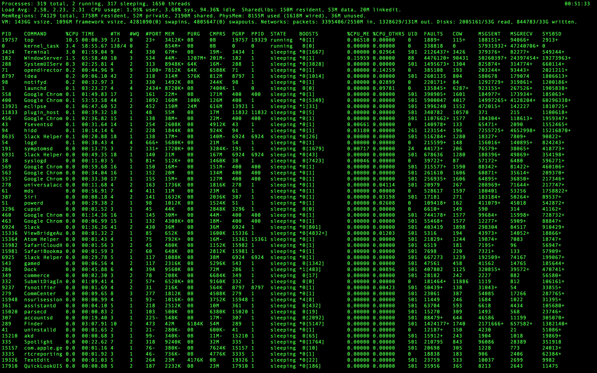
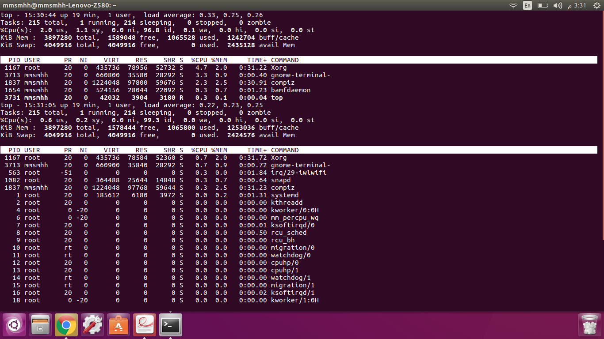
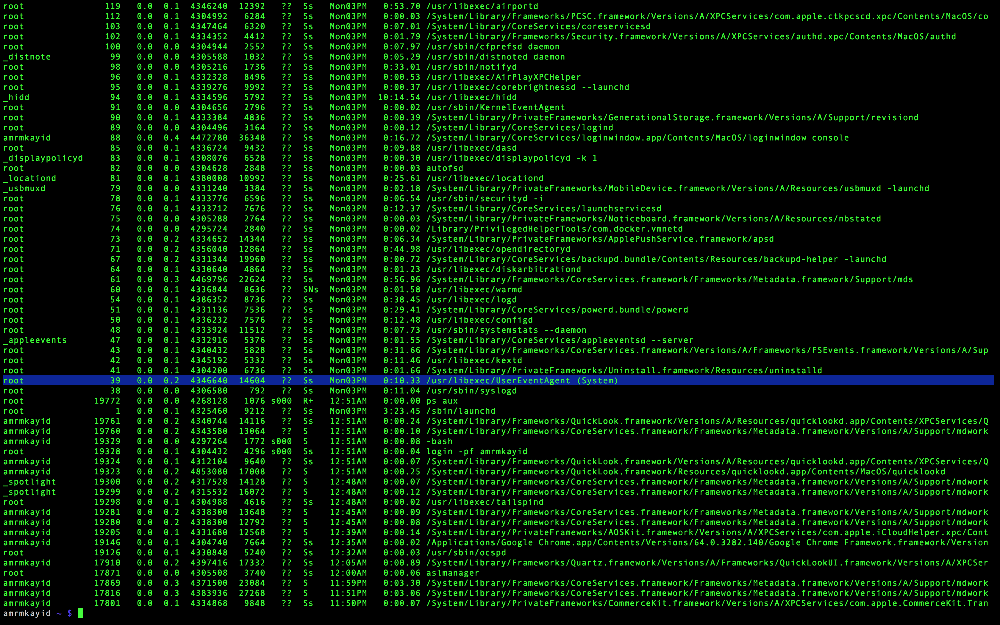
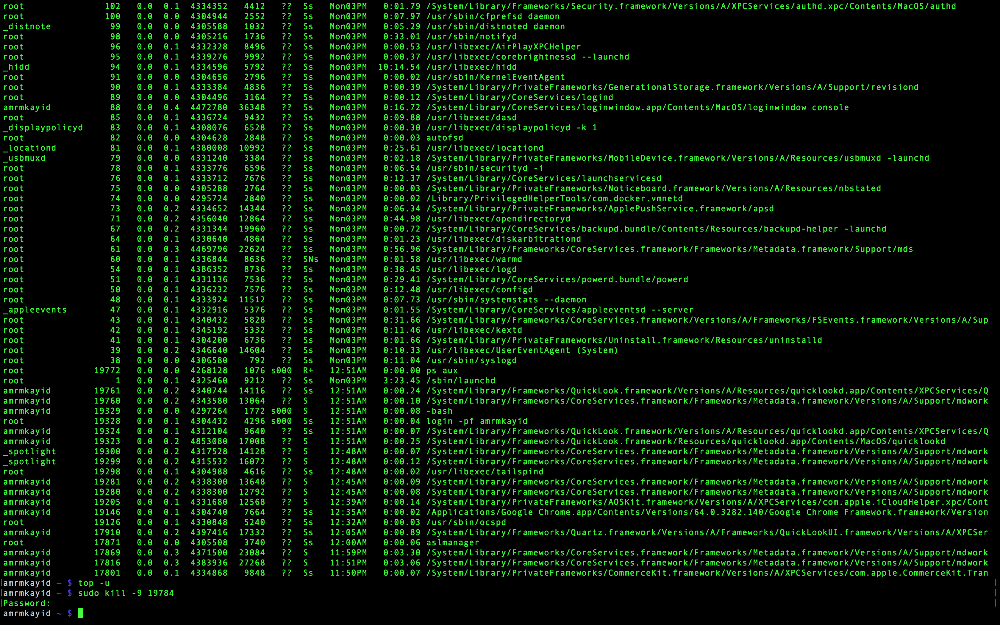
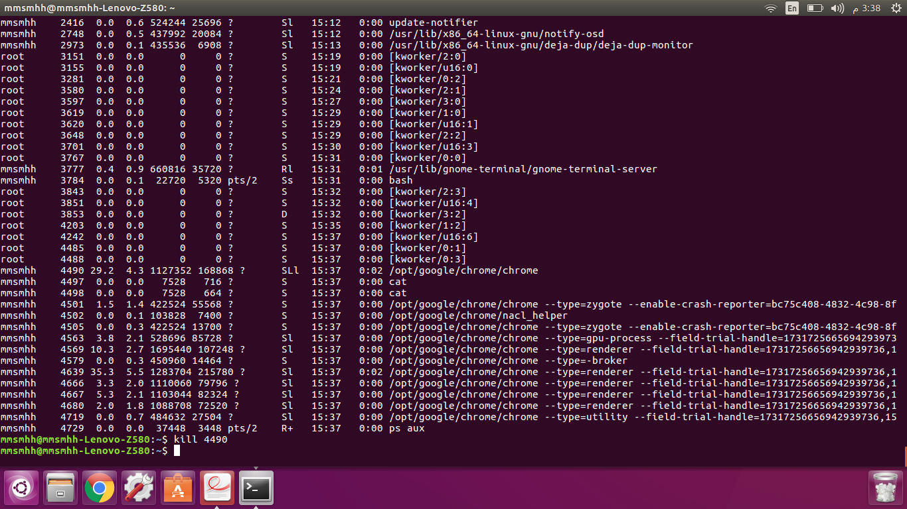

<h1 align="center"> OS Mini Project 1</h1>

## Usage:

compile the c program
```
gcc -o Baseline Baseline.c 
```

run
```
./Baseline [Directory_Name] 
```


### Screenshots
|                    Mac                           |                           Ubuntu                         |
| :-----------------------------------------------:| :------------------------------------------------------: | 
|  |     |
|  |  |
|  |  |
|  |  |
