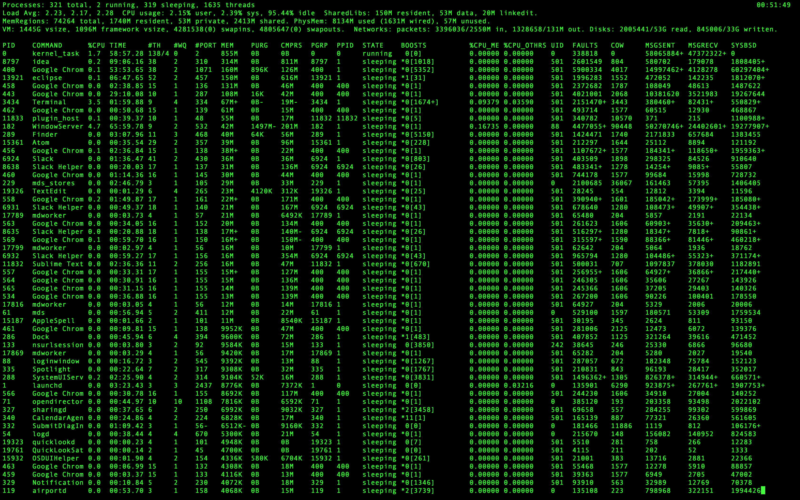

<h1 align="center"> OS Mini Project 1</h1>

## Usage:

compile the c program
```
gcc -o Baseline Baseline.c 
```

run
```
./Baseline [Directory_Name] 
```


### Screenshots
| Mac   |
| :---: | 
|       |
|       |
|       |
|       |
|       |
|       |
